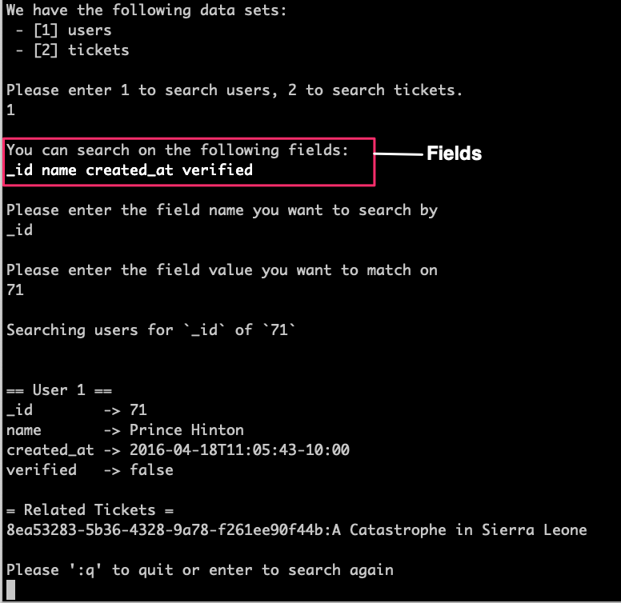
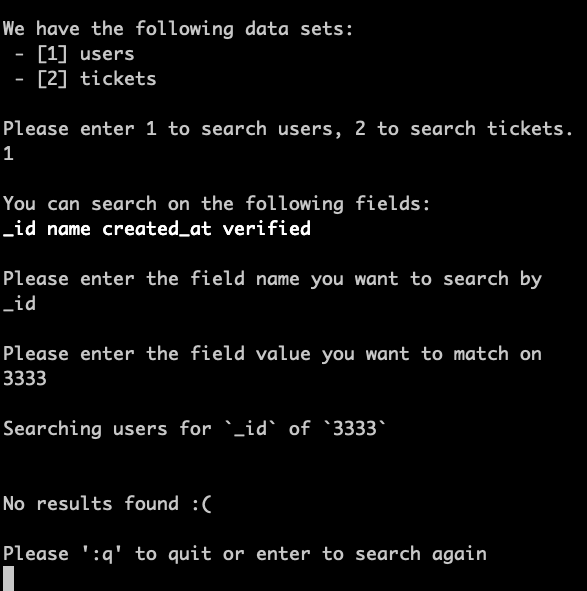

# Rummage

Search across JSON files like it was 1979.

> search unsystematically and untidily through something

## Documentation

- [Data Quality Choices](docs/data-quality-choices.md)
- [Scala Design Choices](docs/scala-design-choices.md)
- [Data Design Choices](docs/data-design-choices.md)
- [Command line App Design Choices](docs/command-line-app-design-choices.md)
- [Caveats](docs/caveats.md)

## Build through SBT (Locally)

All you need is JDK ([8](https://www.oracle.com/au/java/technologies/javase/javase-jdk8-downloads.html) or [11](https://www.oracle.com/java/technologies/javase-jdk11-downloads.html)) and [SBT](https://www.scala-sbt.org/).

Start SBT with 2G of memory:

```
sbt -mem 2048
```


_Why 2G? SBT is usable for longer with more memory otherwise it runs of out of Metaspace due to dynamic classloading_.

### Compiling

Build the production code with:

```
compile
```

Build the production code and test code with:

```
Test / compile
```

### Run Tests

Run the tests with:

```
test
```

### Build API Docs

```
doc
```

Open `target/scala-2.13/api/index.html` to view the API documentation


### Build Application Jar File

Build the fat jar for the application with:

```
assembly
```

### Run the App


Run Rummage specifying the data directory (where the `users.json` and `tickets.json` files live):

```
runMain zendesk.rummage.Rummage <absolute path to data directory>
```

If you want to run the app against a data directory within the project you can use a relative path.

eg. To run it with data from the `resources` folder:

```
runMain zendesk.rummage.Rummage src/main/resources
```


## Build through Docker

Install [Docker](https://docs.docker.com/get-started/).


### Run Tests

Run the tests with:

```
auto/test
```

### Build API Docs

```
auto/doc
```

Open `target/scala-2.13/api/index.html` to view the API documentation


### Build Application Jar File

Build the fat jar for the application with:

```
auto/build
```

### Run the App

Run the app with:

```
auto/run <relative path to data directory within the project>
```

For example to use the default files in `src/main/resources` use:

```
auto/run src/main/resources
```

If you have custom files you would like to load into Rummage put them into the `data-dir` at the root of the project. Ensure the files are named `users.json` and `tickets.json` as they will be loaded using those names:

```
data-dir
├── tickets.json
└── users.json
```

You can then run rummage as:

```
auto/run data-dir
```


## Cli App

### Main Menu


### Searching by User



### Search by User without Match



### Search by Ticket


