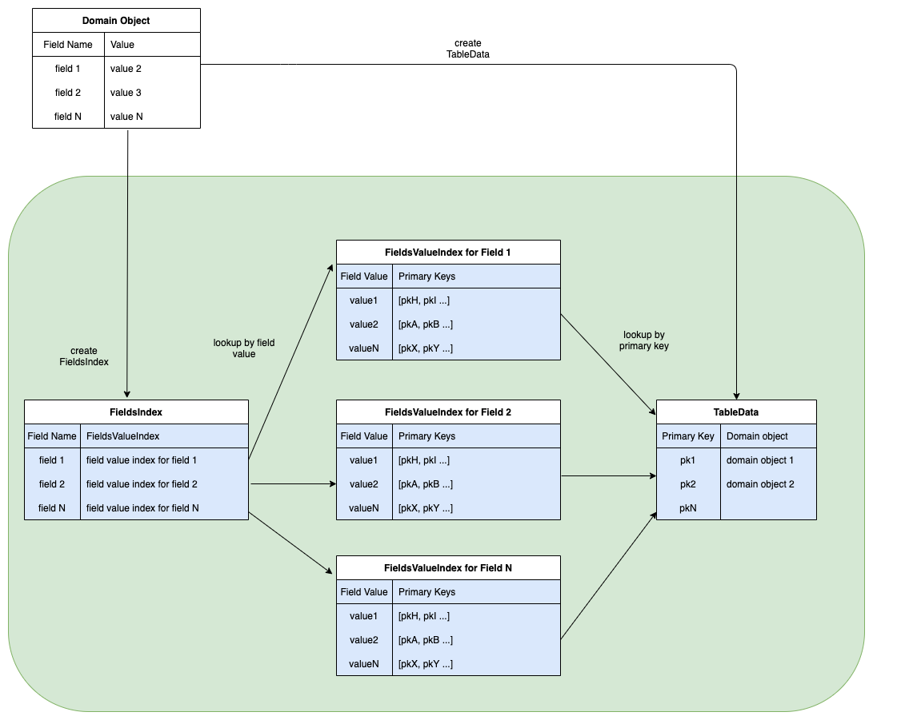

# Data Design Choices

I'm assuming that as stated in the assignment:
> all data can fit into memory on a single machine.

The in-memory indexes are stored in hash maps for quick access. There are two main types of hashes used to store the data.

## TableData

The table data is a map from a primary key to a domain object. This is modelled by `zendesk.rummage.algebra.search.table.TableData`:

```scala
  type TableData[PK, Domain] = Map[PK, Domain]
```

This is a typical table in the relational sense with a primary key.


## FieldsIndex

The fields of a given domain object and their values are stored as nested hash maps. This is modelled by `zendesk.rummage.algebra.search.table.FieldsIndex`:

```scala
type FieldsIndex[PK] = Map[FieldName, Map[FieldValue, Vector[PK]]]
```

Each field name is a key in a hash map and whose values are another hash map with keys being the field value content to a collection of primary keys that map back to the matching domain objects in the `TableData`.


 [source](attachments/rummage-data-design.drawio)
